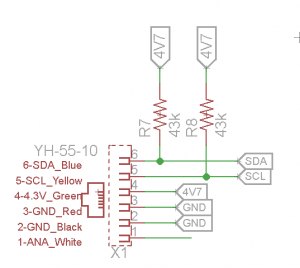
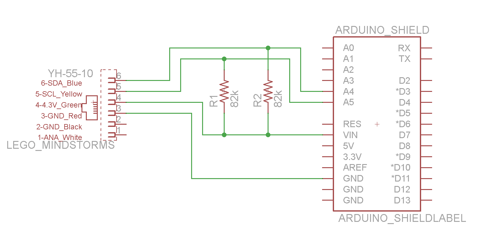
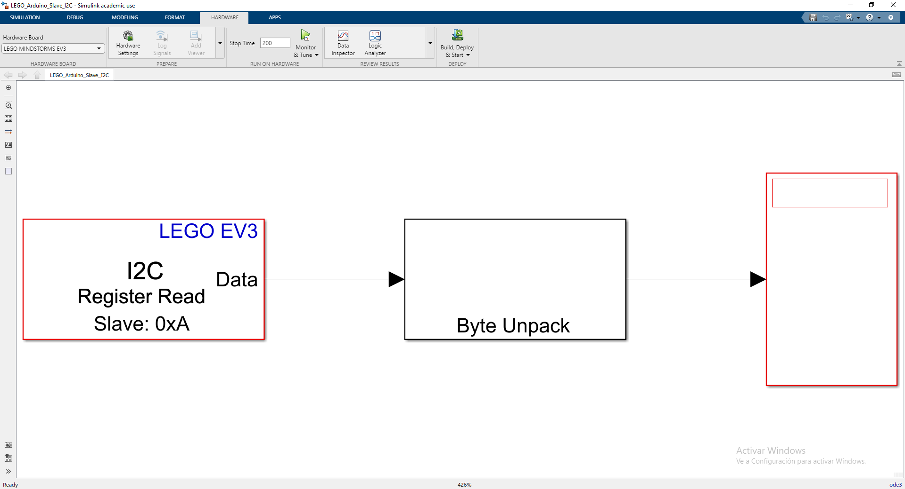
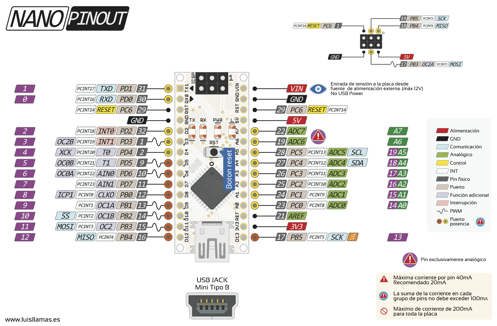

# LEGO EV3 Arduino Bridge I2C

Siguiendo ambos esquematicos, empleando un resistencia entre 43k y 82k será suficiente. 

Y con la linia de 4.7V, se puede alimentar perfectamente a un Arduino Nano, para hacer de slave del LEGO.

Se conectaría tal que así para la arduino nano

En la carpeta LEGO_Arduino_Slave_I2C se puede encontrar un ejemplo base para conectar el arduino al LEGO, y leer con MATLAB los 6 registros de 4 bytes de tipo float del arduino. Empieza el contenido de los 6 registros del 0 al 5, y se van incrementando de 0.01, cada vez que hay una consulta del registro.

## Enlaces empleados:
- https://www.dexterindustries.com/howto/connecting-ev3-arduino/
- https://www.dexterindustries.com/howto/connect-the-arduino-and-the-lego-mindstorms-together/
- https://proyectoarduino.com/bus-i2c/
- PeripheralArduino_LEGOEV3.zip se puede encontrar más documentación de un proyecto anterior.

# Pinout Arduino nano

